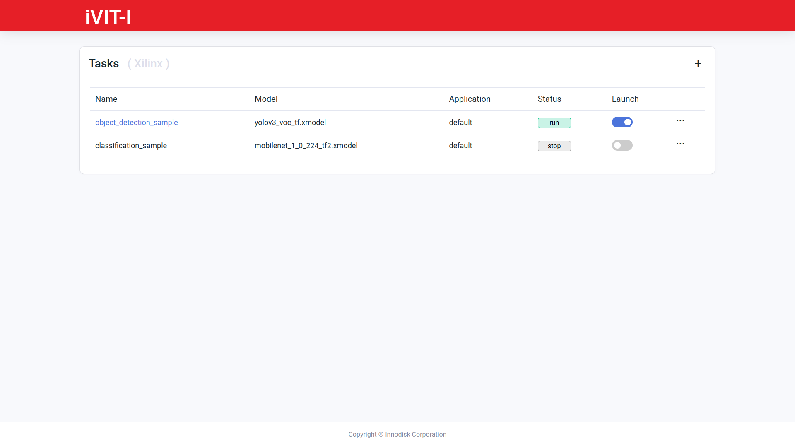
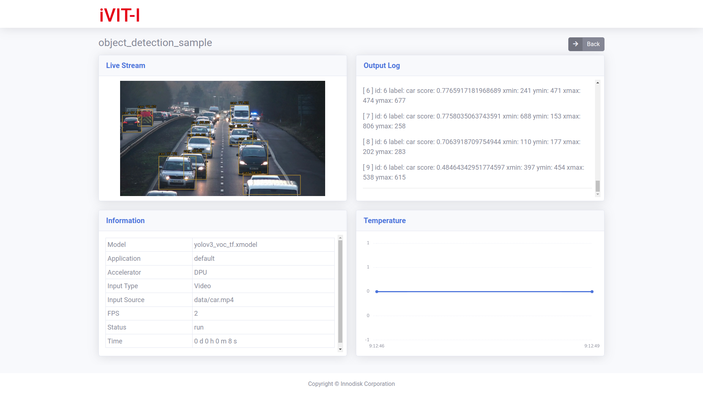

# iVIT-I-Xilinx
iNIT-I is an AI inference tool which could support multiple AI framework and this repository is just for xilin platform.

* [Run Sample](#run-sample)
* [Prepare Environment](#prepare-environment)
* [Fast Testing](#fast-testing)
* [Web API](#web-api)
* [DEMO](#demo)
* [Supported Model](#supported-model)

#  Prepare Environment
1. Download iVIT-I with Web API
    ```bash
    git clone --recurse-submodules https://github.com/InnoIPA/ivit-i-xilinx.git && cd ivit-i-xilinx
    ```
2. Install requirement
    ```bash
    chmod +x ./requirements.sh && sudo ./requirements.sh
    ```

# Run Sample
We use `task.json` to configure each AI tasks and using `<model>.json` to configure each AI models, check [ task configuration ](./docs/task_configuration.md) and [model configuration](./docs/model_configuration.md) to get more detail.

1. Download model ( only in sample task ) and meta data.
    ```bash
    # Model
    ./task/classification_sample/download_model.sh

    # Meta data
    ./task/classification_sample/download_data.sh
    ```
2. Run demo script.
    ``` bash
    python3 demo.py --config task/classification_sample/task.json
    ```
    <details>
        <summary>None-interactive Demo</summary>
        <code> python3 demo.py --config task/classification_sample/task.json -s </code>
        
    </details>
    <br>
3. Run Web Service
    ```bash
    ./exec_web_api.sh
    ```

# Fast Testing
We provide the fast-test for each sample, please check the [document](./test/README.md).


# Web API
<details>
    <summary>
        We recommand <a href="https://www.postman.com/">Postman</a> to test your web api , you could see more detail in <code>{IP Address}:{PORT}/apidocs</code>.
    </summary>
    
</details>
<br>

# DEMO

<details>
    <summary>Demo</summary>
    <p>not figure here</p>
</details>
<details>
    <summary>Web API - Entry</summary>
    
</details>
<details>
    <summary>Web API - Streaming</summary>
    
</details>

<br>
    


# Supported Model
* iVIT-I support the pre-trained model which download from [AI Model Zoo](https://github.com/Xilinx/Vitis-AI/tree/v1.4.1/models/AI-Model-Zoo/model-list).
* Tag: `1.4.X`

|   Name        |   Type    |   Description 
|   ---         |   ---     |   ---
|   Mobile Net  |   Classification  |   https://github.com/Xilinx/Vitis-AI/blob/1.4.1/models/AI-Model-Zoo/model-list/tf2_mobilenetv1_imagenet_224_224_1.15G_1.4/model.yaml
|   YOLOv3      |   Object Detection    |   https://github.com/Xilinx/Vitis-AI/blob/v1.4/models/AI-Model-Zoo/model-list/tf_yolov3_voc_416_416_65.63G_1.4/